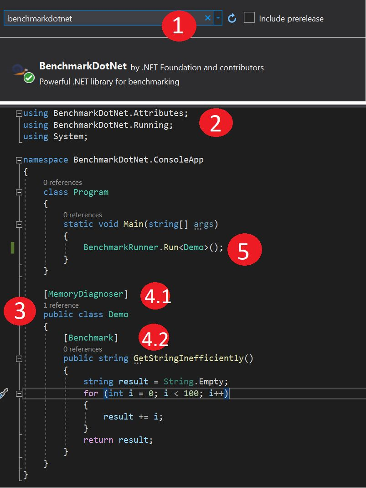
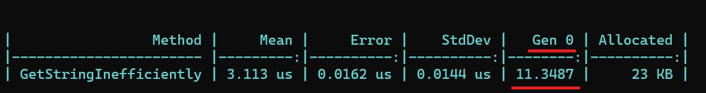

# BenchmarkDotNet :snail:

How to Benchmark your DotNet code in 5 easy steps: [^1][^2]



:one: Install the **BenchmarkDotNet** package from NuGet
```csharp
Install-Package BenchmarkDotNet
```
:two: Add a couple of **using statements**
```csharp
using BenchmarkDotNet.Attributes;
using BenchmarkDotNet.Running;
```
:three: Create a **Demo** class

:four: Add a couple of **decorators**
```csharp
[MemoryDiagnoser]
[Benchmark]
```
:five: Invoke the **BenchmarkRunner** passing your **Demo** class
```csharp
BenchmarkRunner.Run<Demo>();
```
:six: Last but not least, run it on **Release** mode


## Results



## Copy all code from below
```csharp
using BenchmarkDotNet.Attributes;
using BenchmarkDotNet.Running;
using System;

namespace BenchmarkDotNet.ConsoleApp
{
    class Program
    {
        static void Main(string[] args)
        {
            BenchmarkRunner.Run<Demo>();
        }
    }

    [MemoryDiagnoser]
    public class Demo
    {
        [Benchmark]
        public string GetStringInefficiently()
        {
            string result = String.Empty;
            for (int i = 0; i < 100; i++)
            {
                result += i;
            }
            return result;
        }
    }
}
```

[^1]: Intro to Benchmark.net - How To Benchmark C# Code from Tim Corey [https://www.youtube.com/watch?v=mmza9x3QxYE&t=1045s](https://www.youtube.com/watch?v=mmza9x3QxYE&t=1045s)

[^2]: You are doing .NET logging wrong. Let's fix it from Nick Chapsas [https://www.youtube.com/watch?v=bnVfrd3lRv8](https://www.youtube.com/watch?v=bnVfrd3lRv8)

